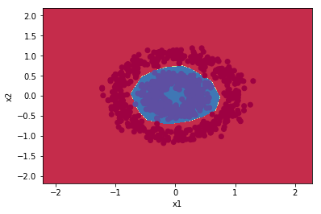
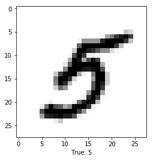

Features supported:
- Batch, mini-batch and stochastic GD
- Gradient Checking
- Batch normalization
- Regularizers:
  - L2
  - Dropout
- Optimizers:
  - Momentum
  - Adam
- Activations:
  - ReLU
  - tanh
  - sigmoid
  - softmax

[Example with sklearn dataset](https://nbviewer.jupyter.org/github/polakowo/numpy-dnn/blob/master/examples/circles.ipynb)

[Example with MNIST dataset](https://nbviewer.jupyter.org/github/polakowo/numpy-dnn/blob/master/examples/mnist.ipynb)

